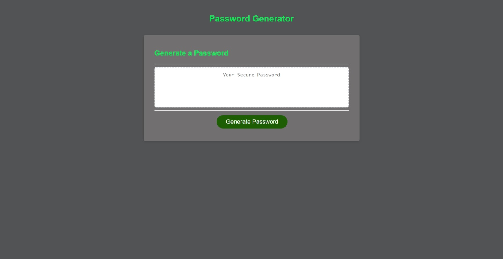

# password_creator

## Description

Have you ever been in a situation where you can't decide what to put in for your password?
Well, I have the solution! I have created a password generator website. This website will allow you to get a simple password within few clicks. Its concise and easy, just choose how many characters you want for your password (between 8 and 128), and you can choose if you want a mix of different characters of just one. Don't forget that you must choose a least one of the options. I hope this helps finding your perfect password.

## Installation
This is the link to the website:
https://isaiasd18.github.io/password_creator/
You don't need to install anything special.

## Usage

The following image shows the web application's appearance and functionality:

## Credits

N/A

## License

MIT License